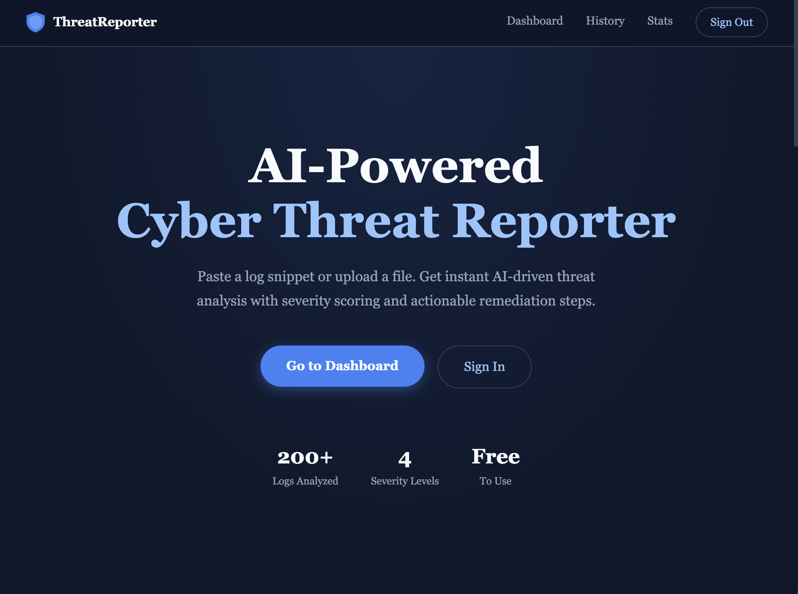
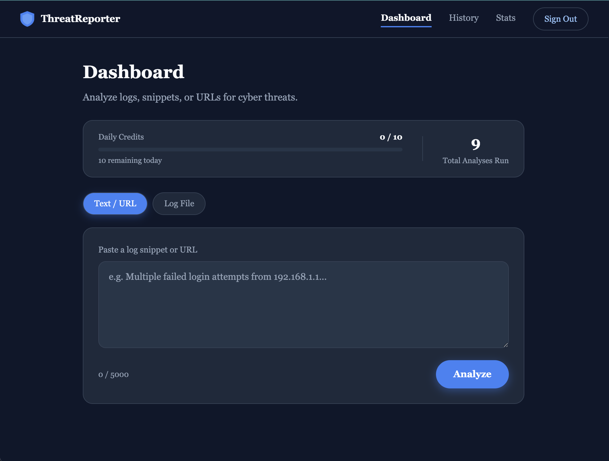
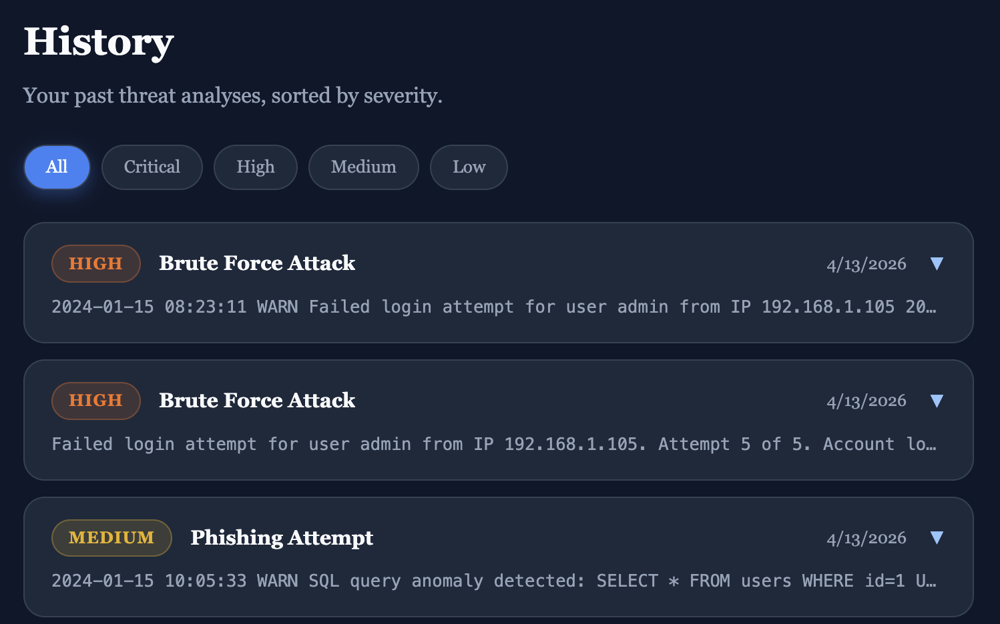
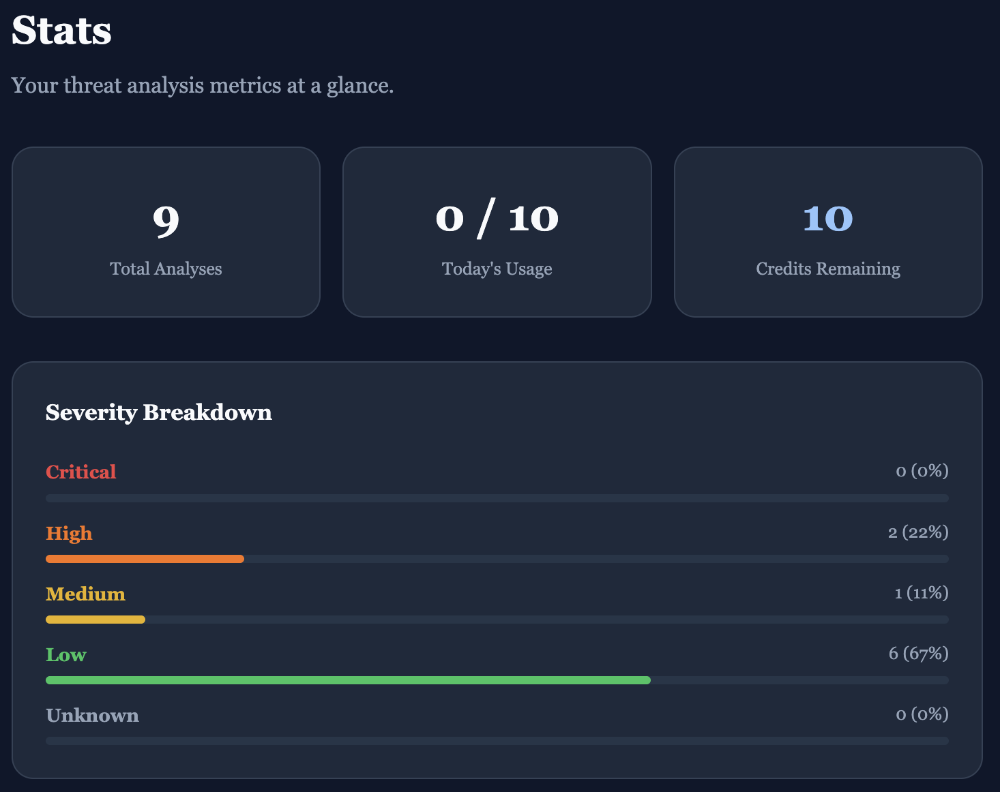

# AI-Powered Cyber Threat Reporter

A full-stack cybersecurity tool that analyzes log snippets, URLs, and log files using Google Gemini AI. Returning structured threat assessments with severity scoring and actionable remediation steps.

**Live:** <!-- [ai-threat-reporter.vercel.app](https://ai-threat-reporter.vercel.app)  --> 



---

## Features

- **AI Threat Analysis** — Paste a log snippet or URL and get an instant structured threat report powered by Gemini 2.0 Flash
- **Severity Scoring** — Every analysis returns a severity level: Low, Medium, High, or Critical
- **Log File Upload** — Upload `.txt` or `.log` files up to 100 lines for batch analysis
- **Secure Auth** — Supabase-powered authentication with per-user history and daily credit limits
- **Threat History** — Browse and filter all past analyses by severity
- **Stats Dashboard** — Visual breakdown of threat types, severity distribution, and usage metrics

---

## Screenshots

| Dashboard | History | Stats |
|-----------|---------|---------|
|  |  |  |


---

## Tech Stack

| Layer | Technology |
|-------|-----------|
| Frontend | React + Tailwind CSS |
| Backend | FastAPI + Python |
| Database | Supabase (PostgreSQL) |
| Auth | Supabase Auth + JWT (ES256) |
| AI | Google Gemini 2.0 Flash |
| URL Scanning | VirusTotal API (soon) |
| Deployment | Render (backend) + Vercel (frontend) |

---

## Local Development

### Prerequisites
- Python 3.10+
- Node.js 18+
- Supabase account
- Gemini API key

### Backend

```bash
cd backend
python3 -m venv venv
source venv/bin/activate
pip install -r requirements.txt
cp .env.example .env   # fill in your keys
uvicorn main:app --reload
```

### Frontend

```bash
cd frontend
npm install
cp .env.example .env   # fill in your keys
npm run dev
```

### Database

Run `backend/schema.sql` in your Supabase SQL editor to create all required tables.

---

## Environment Variables

### Backend (`backend/.env`)

```
GEMINI_API_KEY=
SUPABASE_URL=
SUPABASE_ANON_KEY=
SUPABASE_DB_URL=
SUPABASE_JWT_SECRET=
VIRUSTOTAL_API_KEY=       # leave as is
FRONTEND_ORIGIN=http://localhost:5173
DAILY_CREDIT_LIMIT=10
MAX_INPUT_LENGTH=3000
MAX_FILE_LINES=100
```

### Frontend (`frontend/.env`)

```
VITE_SUPABASE_URL=
VITE_SUPABASE_ANON_KEY=
VITE_API_URL=http://localhost:8000
```

---

## Deployment

- **Backend** — Deploy to [Render](https://render.com) using the included `Dockerfile` and `render.yaml`
- **Frontend** — Deploy to [Vercel](https://vercel.com) with `npx vercel --prod`

---

## Roadmap

- [x] AI threat analysis via Gemini 2.0 Flash
- [x] Structured severity scoring (Low → Critical)
- [x] Log file upload and batch processing
- [x] Secure auth with per-user history
- [x] Daily credit limits and usage tracking
- [x] React frontend 
- [ ] VirusTotal URL scanning
- [ ] PDF export of threat reports
- [ ] Email alerts for Critical findings
- [ ] Fine-tuned threat classification model
- [ ] SIEM-style dashboard with live feed
- [ ] IP reputation lookup integration
- [ ] Team workspaces and shared history
